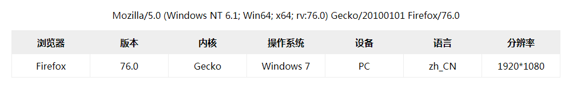

# Browser.js 浏览器信息分析
> Useragent analysis tool.浏览器分析判断工具 - 用户代理、操作系统信息，原项目地址：https://github.com/mumuy/browser

## 实例效果如下图，或参考`example`下的实例文件`index.html`


## 开始使用：
```
<script src="{path}/browser/dist/browser.min.js" type="text/javascript" charset="utf-8"></script>

<script type="text/javascript">
    var info = new Browser();
    console.log(info);
    // output: 
    { device: "PC", language: "zh_CN", engine: "Gecko", browser: "Firefox", os: "Windows", osVersion: "7", version: "76.0", osWidth: 1920, osheight: 1080 }
</script>
```

## 支持的浏览器：

hrome - 谷歌浏览器

Chromium - 谷歌浏览器开源版

IE - 微软IE浏览器

Edge - 微软新一代浏览器

Firefox - 火狐浏览器

Safari - 苹果系统默认浏览器

Opera - Opera浏览器

Vivaldi - Opera联合创始人发布

Yandex - 俄罗斯最大搜索引擎Yandex出品

Arora - 基于webkit和Qt的轻量级浏览器

Lunascape - 来自日本的三引擎浏览器

QupZilla - 轻量级跨平台浏览器

Coc Coc - 越南搜索引擎浏览器

Kindle - 亚马逊电子书

Iceweasel - Firefox浏览器的Debian再发布版

Konqueror

Iceape

SeaMonkey

Epiphany

360 - 360浏览器(手机版)

360SE - 360安全浏览器

360EE - 360极速浏览器

UC - UC浏览器

QQBrowser - QQ浏览器

QQ - QQ客户端

Baidu - 百度浏览器

Maxthon - 傲游浏览器

Sogou - 搜狗浏览器

LBBROWSER - 猎豹浏览器

2345Explorer - 2345浏览器

115Browser - 115浏览器

TheWorld - 世界之窗浏览器

Qiyu - 旗鱼浏览器

XiaoMi - 小米浏览器

Huawei - 华为浏览器

Quark - 夸克浏览器

Wechat - 微信手机客户端

Taobao - 淘宝手机客户端

Alipay - 支付宝手机客户端

Weibo - 微博手机客户端

Douban - 豆瓣手机客户端

Suning - 苏宁易购手机客户端

iQiYi - 爱奇艺手机客户端

DingTalk - 钉钉手机客户端

## 内核：

EdgeHTML

Trident

Presto

WebKit/Blink

Gecko

## 系统或平台

Windows

Linux

Ubuntu

FreeBSD

Debian

Mac	OS

Android

iOS

Windows Phone

BlackBerry

MeeGo

Symbian

Chrome OS

WebOS

## 设备类型

PC - 电脑

Tablet - 平板或PDA

Mobile - 手机


## 注意事项：
> 本项目并非作者原创，原作者`mumuy`及项目`mumuy/browser`请参考[mumuy/browser](https://github.com/mumuy/browser "browser.js")。我只是在原作者项目的基础上进行了功能的增加、使用`webpack`对项目进行归档、打包发布，版权归原作者所有；开发环境请使用`src/browser.js`，生产环境请使用`dist/browser.min.js`。